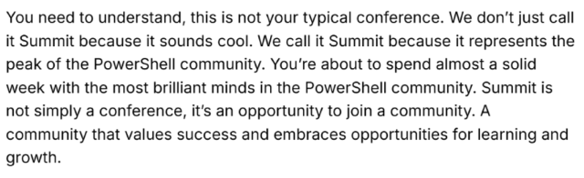

# My first time

Thursday, April 10th marked the end of the PowerShell Summit 2025. This was far different from any other technical conference I've attended, which is exactly the aim of this group.

First this "conference" is all about the community.  And that is made clear from the get go.  The Summitter guide is a document that outlines what you can expect, with a break down of each day.  There is a huge effort made to make everyone feel included and accepted.  There is a large attempt to make sure participants mingle, 'sit with a different group at each meal',  '[observe the pac-man rule](https://www.ericholscher.com/blog/2017/aug/2/pacman-rule-conferences/)', and after hour events specifically targeted at inspiring people to congergate and chat.

## Celebrity Starstruck 🤩
As we filtered into the room for the keyroom I was busy reading name tags, and my brain was racing as I was shocked to see names I sort of recongnized but couldn't quite put my finger on it. [Matthew Dowst](https://psweekly.dowst.dev/), [Jeff Hicks](https://jdhitsolutions.github.io/), [Justin Gtoe](https://justingrote.github.io/) and many others - And it took me a moment to realize these are all people I've followed online. The old adage of 'you should never meet your heros' does not apply to the PowerShell community. I had the great opportunity to meet and even chat with some of the legends of the PowerShell Community. And they did not disappoint. 

### Jeffrey Snover

I litterally got to meet the _**freaking**_ inventor of PowerShell.  Jeffrey gave a presentation to the entire conference on day two, where he shared some of the challanges of his career and of course PowerShell.

> "PowerShell is and always has been about you (the community) and helping you make more than those unix guys." 
> 
> -Jeffery Snover

As a college drop out Jeffrey's career is a fasinating tale, including holding over 30 patents and is a frequent industry speaker. He studied physics at the University of New Hampshire but did not graduate but later became a Microsoft Technical fellow.

previously a Microsoft Technical Fellow. He invented Windows PowerShell, a key automation and scripting tool, and served as Chief Architect for Windows Server and Azure Infrastructure. Before Microsoft, he worked at Tivoli Software, DEC, and startups, focusing on network and systems management. 

### Jeff Hicks & Don Gannon-Jones

Jeff and Don litterally wrote the book on PowerShell that lunched, I mean, 'launched; many journey into the world of PowerShell with 'Learn Windows PowerShell in a Month of Lunches'.  

### Matthew Dowst
Another well known player in the PowerShell world is Mr. Dowst.  A Microsoft MVP in PowerShell with an author  

Matthew Dowst is a Microsoft MVP in PowerShell and Azure Hybrid & Migration, with over 15 years of experience in IT management and consulting. He authored Practical Automation with PowerShell, focusing on enterprise automation solutions. As a Lead Architect of Managed Automations Solutions, he develops automations for enterprise customers. Dowst is also a blogger and enthusiast of PowerShell and DevOps.

### Mike F. Robbins (Agent 47)

It's not often you get to rub shoulders with a famous hitman 🥷, and the person responsible for writing documentation you reference regularly, but hey, this is the PowerShell summit, anything is possible.    A former Microsoft MVP and the lead technical writer for Azure PowerShell at Microsoft. He's the authored [PowerShell 101: The No-Nonsense Guide to Windows PowerShell](https://leanpub.com/powershell101) and co-authored 4th edition of the book Windows PowerShell TFM.

### Justin Grote

### Andrew Pla
The host of _THE_ PowerShell Podcast.

Jennifer Stirrup - PowerShell Summit Keynote

Don Gannon-Jones - First follower

+I got to meet Andrew Pla the host of the PowerShell podcast.

Jeff Hicks
I got to meet Jeffrey Snover, the freaking inventor of PowerShell!

Steven Judd - Rule number one for code: working code is working code.
- You need to matter to someone else.

![_images/2025-04-09-A-Different-Conferenece.png]

Don Gannon-Jones is best known in the PowerShell community for founding the PowerShell + DevOps Global Summit and authoring influential books like Learn Windows PowerShell in a Month of Lunches, which have educated countless IT professionals on PowerShell scripting and automation.

